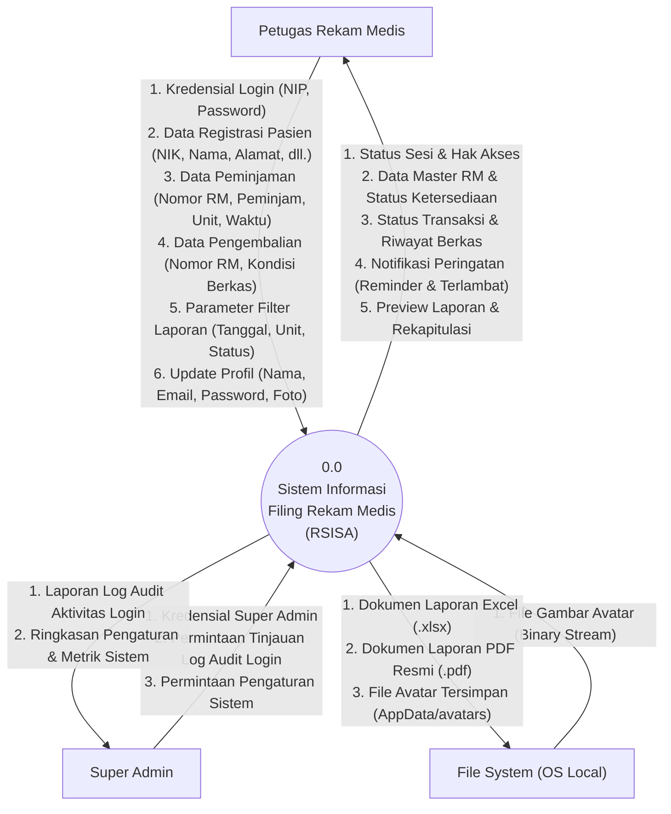

# DFD Level 0 — Diagram Konteks (Context Diagram)

---

## Gambaran Diagram Konteks

Diagram Konteks mendefinisikan batasan terluar (*system boundary*) dari aplikasi **Filing Rekam Medis**, memetakan seluruh entitas eksternal yang berinteraksi langsung dengan sistem beserta aliran input data yang diberikan dan aliran informasi output yang diterima.

---

## Diagram Mermaid DFD Level 0

---

## Penjelasan Entitas Eksternal dan Aliran Data

### 1. Entitas: Petugas Rekam Medis
Pengguna operasional harian di bagian depo filing rekam medis.
- **Input ke Sistem**:
  - `Kredensial Login`: NIP dan password akun.
  - `Data Registrasi Pasien`: Nomor RM, Nama Pasien, NIK 16 digit, Jenis Kelamin, Tanggal Lahir, Alamat.
  - `Data Peminjaman`: Nomor RM, Nama Peminjam, Unit Ruangan, Tanggal Pinjam, Tanggal Berkas Keluar, Jilid, Catatan.
  - `Data Pengembalian`: Nomor RM, Kondisi Berkas (BAIK / RUSAK).
  - `Parameter Filter Laporan`: Rentang tanggal, unit ruangan, status berkas.
  - `Pembaruan Profil`: Nama, Email, Password baru, dan unggahan foto.
- **Output dari Sistem**:
  - `Status Sesi & Hak Akses`: Token sesi lokal dan peran akun.
  - `Data Master RM`: Informasi identitas pasien dan ketersediaan berkas fisik.
  - `Status Transaksi & Riwayat`: Riwayat audit sirkulasi berkas secara kronologis.
  - `Notifikasi Peringatan`: Peringatan 24 jam menjelang batas waktu dan peringatan berkas terlambat.
  - `Preview Rekapitulasi`: Ringkasan peminjaman, pengembalian, dan kepatuhan per ruangan.

### 2. Entitas: Super Admin
Pengguna tingkat administrator dengan kewenangan pengawasan dan pemeliharaan.
- **Input ke Sistem**:
  - `Kredensial Super Admin`: NIP `superadmin` dan kata sandi verifikasi.
  - `Permintaan Log Audit`: Perintah untuk memeriksa catatan aktivitas login.
- **Output dari Sistem**:
  - `Laporan Log Audit`: Daftar seluruh riwayat percobaan login (sukses dan gagal) beserta timestamp dan NIP terkait.

### 3. Entitas: File System (OS Local)
Subsistem penyimpanan file pada komputer lokal pengguna yang diakses melalui API Tauri Plugin FS dan Dialog.
- **Input ke Sistem**:
  - File gambar mentah yang dipilih pengguna untuk foto profil.
- **Output dari Sistem**:
  - Berkas fisik Microsoft Excel (`.xlsx`) hasil ekspor laporan rekapitulasi.
  - Berkas fisik dokumen PDF (`.pdf`) hasil ekspor berita acara peminjaman.
  - Berkas foto profil yang disimpan ke direktori lokal aplikasi (`AppData/avatars/`).
