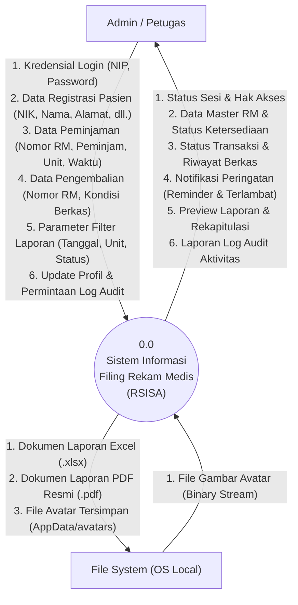

# DFD Level 0 — Diagram Konteks (Context Diagram)

---

## Gambaran Diagram Konteks

Diagram Konteks mendefinisikan batasan terluar (*system boundary*) dari aplikasi **Filing Rekam Medis**, memetakan seluruh entitas eksternal yang berinteraksi langsung dengan sistem beserta aliran input data yang diberikan dan aliran informasi output yang diterima.

Pada sistem ini, hak akses pengguna disederhanakan menjadi **satu peran tunggal**, yaitu **Admin / Petugas**, yang memiliki kewenangan penuh atas seluruh operasional filing dan administrasi sistem tanpa adanya pemisahan peran Super Admin.

---

## Diagram Mermaid DFD Level 0

```mermaid
flowchart TD
    %% Entitas Eksternal
    E1["Admin / Petugas"]
    E2["File System (OS Local)"]

    %% Proses Tunggal
    P0(("0.0<br/>Sistem Informasi<br/>Filing Rekam Medis<br/>(RSISA)"))

    %% Aliran Data Admin / Petugas
    E1 -->|"1. Kredensial Login (NIP, Password)<br/>2. Data Registrasi Pasien (NIK, Nama, Alamat, dll.)<br/>3. Data Peminjaman (Nomor RM, Peminjam, Unit, Waktu)<br/>4. Data Pengembalian (Nomor RM, Kondisi Berkas)<br/>5. Parameter Filter Laporan (Tanggal, Unit, Status)<br/>6. Update Profil & Permintaan Log Audit"| P0

    P0 -->|"1. Status Sesi & Hak Akses<br/>2. Data Master RM & Status Ketersediaan<br/>3. Status Transaksi & Riwayat Berkas<br/>4. Notifikasi Peringatan (Reminder & Terlambat)<br/>5. Preview Laporan & Rekapitulasi<br/>6. Laporan Log Audit Aktivitas"| E1

    %% Aliran Data File System
    E2 -->|"1. File Gambar Avatar (Binary Stream)"| P0
    P0 -->|"1. Dokumen Laporan Excel (.xlsx)<br/>2. Dokumen Laporan PDF Resmi (.pdf)<br/>3. File Avatar Tersimpan (AppData/avatars)"| E2
```

---

## Penjelasan Entitas Eksternal dan Aliran Data

### 1. Entitas: Admin / Petugas
Pengguna tunggal sistem yang memiliki hak akses penuh (*single user role*) untuk menangani seluruh operasional harian di bagian depo filing rekam medis sekaligus fungsi administratif sistem.
- **Input ke Sistem**:
  - `Kredensial Login`: NIP dan password akun.
  - `Data Registrasi Pasien`: Nomor RM, Nama Pasien, NIK 16 digit, Jenis Kelamin, Tanggal Lahir, Alamat.
  - `Data Peminjaman`: Nomor RM, Nama Peminjam, Unit Ruangan, Tanggal Pinjam, Tanggal Berkas Keluar, Jilid, Catatan.
  - `Data Pengembalian`: Nomor RM, Kondisi Berkas (BAIK / RUSAK).
  - `Parameter Filter Laporan`: Rentang tanggal, unit ruangan, status berkas.
  - `Pembaruan Profil`: Nama, Email, Password baru, dan unggahan foto.
  - `Permintaan Log Audit`: Perintah untuk memeriksa catatan aktivitas login.
- **Output dari Sistem**:
  - `Status Sesi & Hak Akses`: Sesi aktif lokal dan status otentikasi.
  - `Data Master RM`: Informasi identitas pasien dan status ketersediaan berkas fisik.
  - `Status Transaksi & Riwayat`: Riwayat audit sirkulasi berkas secara kronologis.
  - `Notifikasi Peringatan`: Peringatan 24 jam menjelang batas waktu dan peringatan berkas terlambat.
  - `Preview Rekapitulasi`: Ringkasan peminjaman, pengembalian, dan kepatuhan per ruangan.
  - `Laporan Log Audit`: Catatan riwayat percobaan login ke sistem.

### 2. Entitas: File System (OS Local)
Subsistem penyimpanan file pada komputer lokal pengguna yang diakses melalui API Tauri Plugin FS dan Dialog.
- **Input ke Sistem**:
  - File gambar mentah yang dipilih pengguna untuk foto profil.
- **Output dari Sistem**:
  - Berkas fisik Microsoft Excel (`.xlsx`) hasil ekspor laporan rekapitulasi.
  - Berkas fisik dokumen PDF (`.pdf`) hasil ekspor berita acara peminjaman.
  - Berkas foto profil yang disimpan ke direktori lokal aplikasi (`AppData/avatars/`).
