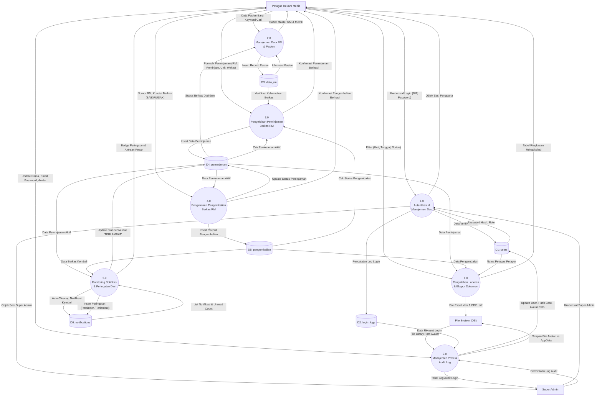

# DFD Level 1 — Dekomposisi Sistem

---

## Gambaran DFD Level 1

DFD Level 1 mendekomposisi proses utama sistem filing menjadi **7 sub-proses fungsional**, menunjukkan secara transparan bagaimana data dipertukarkan antara entitas eksternal, proses pengolahan, dan 6 data store logis.

---

## Diagram Mermaid DFD Level 1

---

## Deskripsi Rinci Sub-Proses

### Proses 1.0: Autentikasi & Manajemen Sesi
- **Tujuan**: Memverifikasi identitas pengguna, mengamankan hak akses, dan mencatat riwayat masuk ke sistem.
- **Input**: NIP dan password teks polos.
- **Penyimpanan Terlibat**: Membaca `D1: users`, menulis log percobaan ke `D2: login_logs`.
- **Output**: Sesi pengguna terotentikasi berisi ID, NIP, Nama, dan Peran (*Role*).

### Proses 2.0: Manajemen Data RM & Pasien
- **Tujuan**: Mendaftarkan identitas pasien baru, memvalidasi NIK 16 digit, dan menampilkan daftar master rekam medis beserta status ketersediaan fisiknya.
- **Input**: Nomor RM, NIK, Nama Pasien, Jenis Kelamin, Tanggal Lahir, Alamat.
- **Penyimpanan Terlibat**: Menulis dan membaca `D3: data_rm`, membaca `D4: peminjaman` untuk menghitung total peminjaman dan ketersediaan berkas.
- **Output**: Daftar master RM teragregasi dan ringkasan metrik statistik.

### Proses 3.0: Pengelolaan Peminjaman Berkas RM
- **Tujuan**: Memvalidasi ketersediaan fisik berkas (memastikan berkas tidak sedang dipinjam oleh ruangan lain) dan mencatat transaksi peminjaman baru.
- **Input**: Nomor RM, Nama Peminjam, Unit Ruangan, Tanggal Pinjam, Tanggal Berkas Keluar, Jilid, Catatan.
- **Penyimpanan Terlibat**: Membaca `D3: data_rm`, membaca `D4: peminjaman` & `D5: pengembalian`, menulis transaksi baru ke `D4: peminjaman`.
- **Output**: Konfirmasi peminjaman berhasil atau notifikasi penolakan peminjaman ganda.

### Proses 4.0: Pengelolaan Pengembalian Berkas RM
- **Tujuan**: Memproses pengembalian fisik berkas, mencatat kondisi (BAIK/RUSAK), dan mengupdate status peminjaman secara aman (*transactional rollback*).
- **Input**: Nomor RM yang dikembalikan, pilihan kondisi berkas.
- **Penyimpanan Terlibat**: Membaca dan memperbarui status pada `D4: peminjaman`, menyisipkan record pengembalian ke `D5: pengembalian`.
- **Output**: Bukti konfirmasi berkas telah diterima kembali di depo filing.

### Proses 5.0: Monitoring Notifikasi & Peringatan Dini
- **Tujuan**: Melakukan sinkronisasi waktu pasif terhadap batas waktu 48 jam, membersihkan notifikasi berkas yang telah kembali, dan memicu peringatan REMINDER ($\le$ 24 jam) atau TERLAMBAT ($> 48$ jam).
- **Input**: Timestamp waktu berjalan sistem komputer.
- **Penyimpanan Terlibat**: Membaca `D4: peminjaman` & `D5: pengembalian`, memutakhirkan status peminjaman pada `D4: peminjaman`, mengelola baris antrean pada `D6: notifications`.
- **Output**: Tampilan badge lonceng belum dibaca dan daftar pesan pengingat di antarmuka pengguna.

### Proses 6.0: Pengolahan Laporan & Ekspor Dokumen
- **Tujuan**: Menghasilkan rekapitulasi kepatuhan peminjaman per ruangan dan mengekspor dokumen resmi bertanda tangan.
- **Input**: Parameter filter rentang tanggal, unit ruangan, dan status berkas.
- **Penyimpanan Terlibat**: Membaca data relasi dari `D4: peminjaman`, `D5: pengembalian`, dan `D1: users`.
- **Output**: Tampilan tabel rekapitulasi di layar, file Microsoft Excel (`.xlsx`), dan dokumen cetak Adobe PDF (`.pdf`) yang tersimpan di media penyimpanan pengguna (`E3: File System`).

### Proses 7.0: Manajemen Profil & Audit Log
- **Tujuan**: Mengelola informasi akun pengguna, fasilitas ubah kata sandi, penyimpanan avatar ke folder lokal aplikasi, serta penyajian riwayat audit log bagi Super Admin.
- **Input**: Data profil baru, password lama & baru, file gambar profil, filter log.
- **Penyimpanan Terlibat**: Memperbarui `D1: users`, membaca `D2: login_logs`, membaca/menulis file fisik di `E3: File System`.
- **Output**: Profil terbarui dan tabel rekapitulasi audit login.
