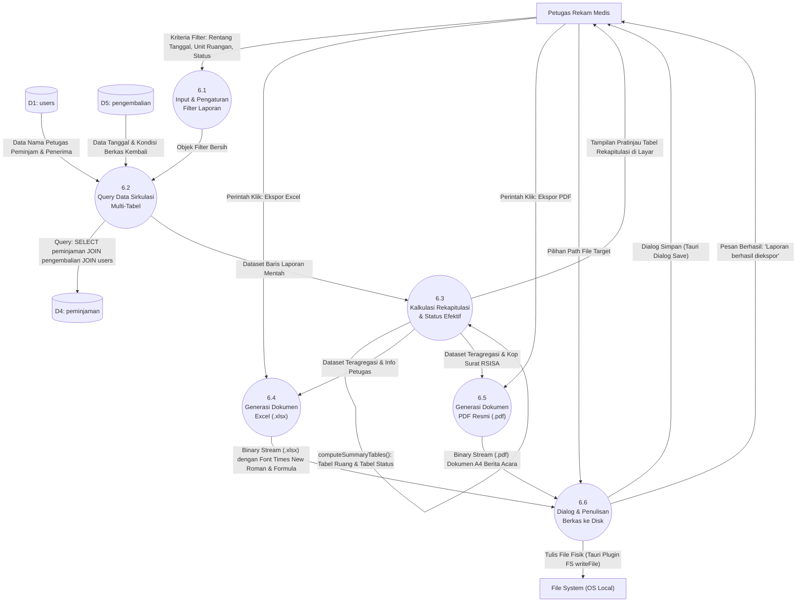

# DFD Level 2 — Proses 6.0: Pengolahan Laporan dan Ekspor Dokumen

---

## Gambaran Proses 6.0

DFD Level 2 ini menguraikan alur pengumpulan data transaksi sirkulasi berkas, proses agregasi rekapitulasi analitik, hingga pembentukan berkas ekspor Microsoft Excel dan Adobe PDF melalui pustaka ExcelJS dan jsPDF.

---

## Diagram Mermaid DFD Level 2 — Laporan

---

## Rincian Sub-Proses

### 6.1 Input & Pengaturan Filter Laporan
- **Deskripsi**: Petugas menentukan batasan laporan pada antarmuka `Laporan.tsx`:
  - `startDate` & `endDate`: Rentang tanggal pinjam (format: `YYYY-MM-DD`).
  - `unit`: Pemilihan unit spesifik dari 22 opsi atau opsi `'Semua'`.
  - `status`: Filter status sirkulasi (`'DIPINJAM'`, `'DIKEMBALIKAN'`, `'TERLAMBAT'`, atau `'Semua'`).

### 6.2 Query Data Sirkulasi Multi-Tabel (`getLaporanData`)
- **Deskripsi**: Mengambil seluruh baris peminjaman yang cocok dengan parameter filter melalui query `LEFT JOIN`:
  - `peminjaman` sebagai basis data transaksi.
  - `pengembalian` untuk melihat tanggal berkas kembali dan kondisi berkas.
  - `users` (alias `u1` dan `u2`) untuk menyertakan nama petugas operator dan petugas penerima.

### 6.3 Kalkulasi Rekapitulasi & Status Efektif (`computeSummaryTables`)
- **Deskripsi**:
  1. Menghitung status efektif dinamis per baris data dengan `calculateEffectiveStatus(tanggalBerkasKeluar, tanggalPinjam, tanggalBerkasKembali)`.
  2. Mengelompokkan statistik ke dalam `roomMap` untuk menghasilkan:
     - **Tabel Rekapitulasi Ruangan**: Total pinjam, total kembali, belum kembali, tepat waktu, terlambat, dan persentasenya.
     - **Tabel Status Berkas**: Jumlah total berkas telah dipinjam, berkas telah dikembalikan, dan berkas terlambat.

### 6.4 Generasi Dokumen Excel (.xlsx) (`exportToExcel`)
- **Deskripsi**: Mengonstruksi lembar kerja Excel profesional via **ExcelJS**:
  - Halaman A4 Landscape.
  - Tipografi formal: **Times New Roman**.
  - Header tabel hijau (`#056839`), judul kuning (`#FFFF00`).
  - 13 kolom rekapitulasi ruangan lengkap dengan format persentase otomatis (`0.0%`).
  - Bagian tanda tangan Kepala Unit Rekam Medis dan Petugas Pelapor.

### 6.5 Generasi Dokumen PDF Resmi (.pdf) (`exportToPdf`)
- **Deskripsi**: Membangun dokumen cetak berita acara resmi via **jsPDF** & **jspdf-autotable**:
  - Format kertas A4 Portrait.
  - Kop resmi RSI Sultan Agung Semarang (memuat logo `/logorsi.png` dan alamat kantor Jl. Kaligawe Raya No. 4 Semarang).
  - Penomoran otomatis berita acara: `042/BA-REKAMMED/RSISA/{year}`.
  - Tabel rekapitulasi bergaris dan lembar legalitas tanda tangan ganda.

### 6.6 Dialog & Penulisan Berkas ke Disk
- **Deskripsi**: Membuka antarmuka pemilih folder bawaan Windows melalui `@tauri-apps/plugin-dialog` (`save()`), kemudian mengonversi buffer memori dokumen menjadi file fisik di hard disk via `@tauri-apps/plugin-fs` (`writeFile()`).
