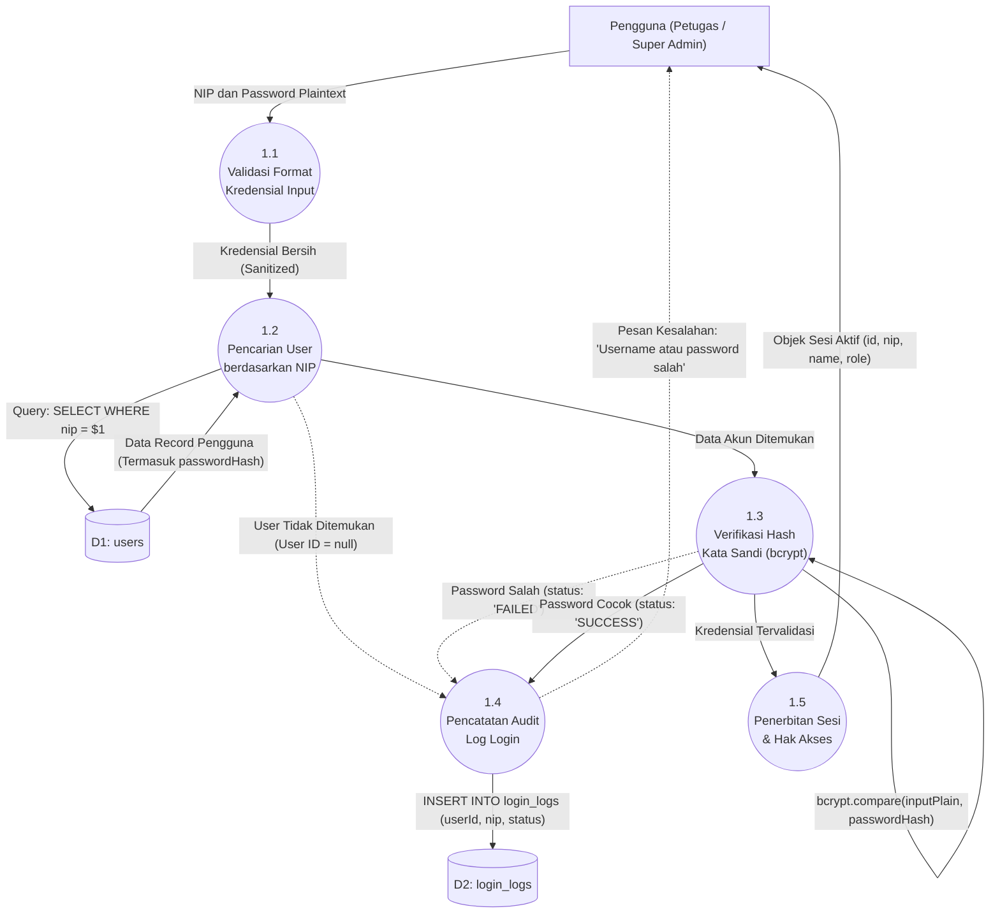

# DFD Level 2 — Proses 1.0: Autentikasi dan Manajemen Sesi

---

## Gambaran Proses 1.0

DFD Level 2 ini menguraikan secara rinci alur verifikasi kredensial saat pengguna (Petugas atau Super Admin) melakukan proses masuk (*login*) ke dalam sistem hingga sesi pengguna aktif dibentuk dan jejak audit tersimpan.

---

## Diagram Mermaid DFD Level 2 — Login



---

## Rincian Sub-Proses

### 1.1 Validasi Format Kredensial Input
- **Deskripsi**: Memeriksa bahwa kolom NIP dan kata sandi tidak kosong serta memangkas spasi berlebih (*trimming*).
- **Logika**: Jika kosong, langsung memicu pesan peringatan form di antarmuka sebelum memanggil lapisan database.

### 1.2 Pencarian Pengguna Berdasarkan NIP
- **Deskripsi**: Mengambil data akun dari data store `D1: users` menggunakan parameter NIP (`SELECT id, nip, passwordHash, name, role, avatarPath FROM users WHERE nip = $1`).
- **Penanganan Khusus**: Jika NIP tidak ditemukan di database, alur langsung dialihkan ke proses pencatatan log dengan status `'FAILED'` dan menyajikan pesan generik demi alasan keamanan (tidak membocorkan apakah NIP atau kata sandinya yang salah).

### 1.3 Verifikasi Hash Kata Sandi (`bcrypt.compare`)
- **Deskripsi**: Membandingkan teks polos kata sandi input dengan hash bcrypt yang tersimpan di kolom `passwordHash` menggunakan fungsi asinkron `bcrypt.compare()`.
- **Hasil**: Menghasilkan nilai boolean `true` jika cocok, atau `false` jika tidak sesuai.

### 1.4 Pencatatan Audit Log Login (`logLogin`)
- **Deskripsi**: Menyimpan rekam jejak setiap usaha login ke data store `D2: login_logs` dengan kolom:
  - `userId`: ID pengguna (atau `null` jika NIP tidak terdaftar)
  - `nip`: NIP yang diinputkan
  - `status`: `'SUCCESS'` jika berhasil, `'FAILED'` jika gagal.

### 1.5 Penerbitan Sesi dan Hak Akses
- **Deskripsi**: Membangun objek sesi pengguna di memori React (`AuthContext`):
  ```typescript
  {
    id: user.id,
    nip: user.nip,
    name: user.name,
    email: user.email,
    role: user.role, // 'Super Admin' atau 'PETUGAS'
    avatarPath: user.avatarPath
  }
  ```
  Objek ini menentukan kontrol visibilitas menu navigasi dan otorisasi akses rute halaman.
