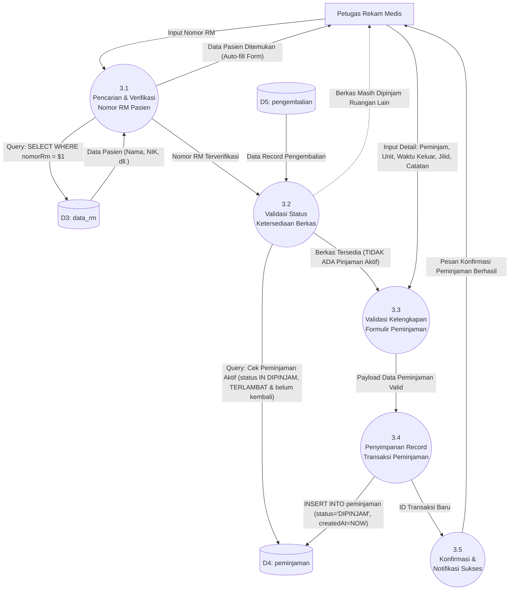

# DFD Level 2 — Proses 3.0: Pengelolaan Peminjaman Berkas RM

---

## Gambaran Proses 3.0

DFD Level 2 ini menguraikan alur validasi dan pencatatan transaksi peminjaman berkas rekam medis fisik pada modul **Peminjaman Baru** (`AjukanPeminjaman.tsx`) dan `peminjamanService.ts`.

---

## Diagram Mermaid DFD Level 2 — Peminjaman



---

## Rincian Sub-Proses

### 3.1 Pencarian & Verifikasi Nomor RM Pasien
- **Deskripsi**: Petugas menginputkan Nomor RM pada kolom pencarian formulir.
- **Query**: Membaca data store `D3: data_rm` (`SELECT nomorRm, namaPasien FROM data_rm WHERE nomorRm = $1`).
- **Output Aliran**: Jika ditemukan, nama pasien otomatis terisi pada formulir antarmuka. Jika tidak ditemukan, formulir memberikan opsi untuk mendaftarkan pasien baru ke master data terlebih dahulu.

### 3.2 Validasi Status Ketersediaan Berkas (`checkActivePeminjaman`)
- **Deskripsi**: Mencegah peminjaman ganda (*double borrowing*) pada berkas fisik yang sama.
- **Logika SQL**:
  ```sql
  SELECT p.* FROM peminjaman p
  LEFT JOIN pengembalian pg ON pg.peminjamanId = p.id
  WHERE p.nomorRm = $1
    AND p.status IN ('DIPINJAM', 'TERLAMBAT')
    AND pg.id IS NULL
  ORDER BY p.tanggalPinjam DESC LIMIT 1;
  ```
- **Kondisi Penolakan**: Jika query mengembalikan data peminjaman aktif, sistem menampilkan modal peringatan detail berisi nama unit peminjam saat ini, nama dokter/perawat peminjam, dan batas waktu pengembalian. Peminjaman baru untuk nomor RM tersebut diblokir.

### 3.3 Validasi Kelengkapan Formulir Peminjaman
- **Deskripsi**: Memastikan seluruh atribut wajib terisi:
  - `nomorRm` (Wajib)
  - `namaPeminjam` (Wajib, nama dokter/perawat)
  - `unit` (Wajib, pilihan dari salah satu daftar 22 unit ruangan)
  - `tanggalPinjam` (Wajib, format ISO timestamp)
  - `tanggalBerkasKeluar` (Waktu aktual fisik berkas keluar dari filing)
  - `jilid` (Opsional)
  - `catatan` (Opsional)

### 3.4 Penyimpanan Record Transaksi Peminjaman (`createPeminjaman`)
- **Deskripsi**: Menyimpan data peminjaman baru ke data store `D4: peminjaman`.
- **Query**:
  ```sql
  INSERT INTO peminjaman (
    nomorRm, namaPasien, peminjamId, namaPeminjam, unit,
    tanggalPinjam, tanggalBerkasKeluar, jilid, catatan, status, createdAt
  ) VALUES ($1, $2, $3, $4, $5, $6, $7, $8, $9, 'DIPINJAM', CURRENT_TIMESTAMP);
  ```
- **Catatan**: Kolom `peminjamId` mencatat ID akun petugas rekam medis yang sedang aktif login sebagai operator pencatat transaksi.

### 3.5 Konfirmasi & Notifikasi Sukses
- **Deskripsi**: Mengembalikan pesan sukses ke antarmuka pengguna dan mengalihkan navigasi ke halaman **Daftar Peminjaman** (`DaftarPeminjaman.tsx`).
