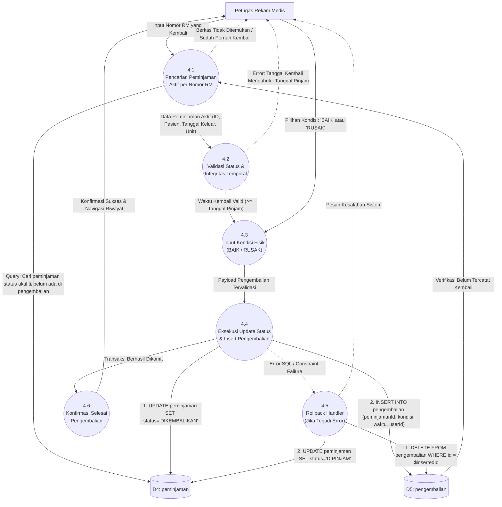

# DFD Level 2 — Proses 4.0: Pengelolaan Pengembalian Berkas RM

---

## Gambaran Proses 4.0

DFD Level 2 ini menguraikan alur verifikasi fisik dan eksekusi transaksi pengembalian berkas rekam medis pada modul **Proses Pengembalian** (`ProsesPengembalian.tsx`) dan `pengembalianService.ts`, termasuk proteksi rollback transaksional.

---

## Diagram Mermaid DFD Level 2 — Pengembalian



---

## Rincian Sub-Proses

### 4.1 Pencarian Peminjaman Aktif per Nomor RM (`findActivePeminjamanByRm`)
- **Deskripsi**: Mencari data transaksi peminjaman terbuka untuk nomor rekam medis yang diinputkan.
- **Query**:
  ```sql
  SELECT p.*, u.name as peminjamName
  FROM peminjaman p
  LEFT JOIN users u ON p.peminjamId = u.id
  LEFT JOIN pengembalian pg ON pg.peminjamanId = p.id
  WHERE p.nomorRm = $1
    AND p.status IN ('DIPINJAM', 'TERLAMBAT')
    AND pg.id IS NULL
  ORDER BY p.tanggalPinjam DESC LIMIT 1;
  ```
- **Pengecualian**: Jika baris tidak ditemukan, sistem memberi tahu petugas bahwa berkas tersebut saat ini sedang berada di filing (tidak ada status pinjam).

### 4.2 Validasi Status & Integritas Temporal
- **Deskripsi**: Memastikan timestamp pengembalian logis terhadap riwayat peminjaman.
- **Logika**:
  - `returnDate` diambil dari timestamp waktu aktual saat konfirmasi (`new Date().toISOString()`).
  - Waktu kembali tidak boleh lebih lampau daripada `tanggalBerkasKeluar` atau `tanggalPinjam`.

### 4.3 Input Kondisi Fisik Berkas
- **Deskripsi**: Petugas filing memeriksa fisik map berkas dokumen rekam medis yang diserahkan dan memilih kondisi:
  - `BAIK`: Berkas utuh dan lengkap.
  - `RUSAK`: Berkas robek, basah, atau terdapat lembaran formulir rekam medis yang hilang/rusak.

### 4.4 Eksekusi Transaksional Berlapis (`processPengembalian`)
- **Tahap 1**: Mengubah status peminjaman menjadi `'DIKEMBALIKAN'`:
  ```sql
  UPDATE peminjaman SET status = 'DIKEMBALIKAN', updatedAt = CURRENT_TIMESTAMP WHERE id = $1;
  ```
- **Tahap 2**: Menyisipkan baris riwayat ke tabel `pengembalian`:
  ```sql
  INSERT INTO pengembalian (
    peminjamanId, tanggalBerkasKembali, dikembalikanOlehId, konfirmasiKembali, kondisiBerkas
  ) VALUES ($1, $2, $3, 1, $4);
  ```
  *(Catatan: Constraint `peminjamanId UNIQUE` pada skema database menjamin tidak akan terjadi duplikasi baris pengembalian).*

### 4.5 Penanganan Kegagalan dan Rollback Otomatis
- **Deskripsi**: Jika terjadi kegagalan sistem atau penolakan constraint SQL saat eksekusi:
  1. Hapus record pengembalian parsial jika sempat terbuat (`DELETE FROM pengembalian WHERE id = $insertedId`).
  2. Kembalikan status peminjaman ke semula (`UPDATE peminjaman SET status = 'DIPINJAM'`).
  3. Lemparkan pesan kesalahan ramah pengguna.

### 4.6 Konfirmasi Selesai Pengembalian
- **Deskripsi**: Menampilkan notifikasi pop-up sukses dan memindahkan tampilan pengguna ke halaman **Daftar Pengembalian**.
